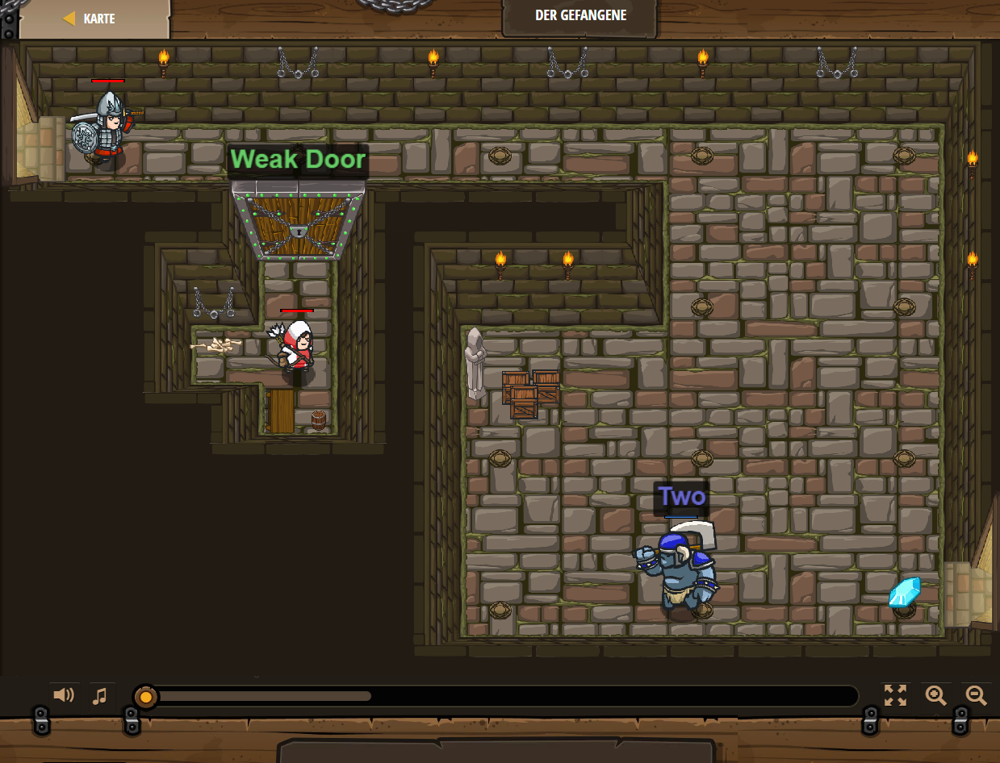

## **Der Gefangene**
## Level 1.10

#### Neu Gelerntes:
<b>-</b>

[comment]: <> (Was wurde gelernt und wie funktioniert die Technik?)

#### JavaScript-Code:
```js
hero.moveRight();
hero.attack("Weak Door");
hero.moveRight(2);
hero.moveDown(3);
var enemy = hero.findNearestEnemy();
hero.attack(enemy);
hero.moveRight();
```
