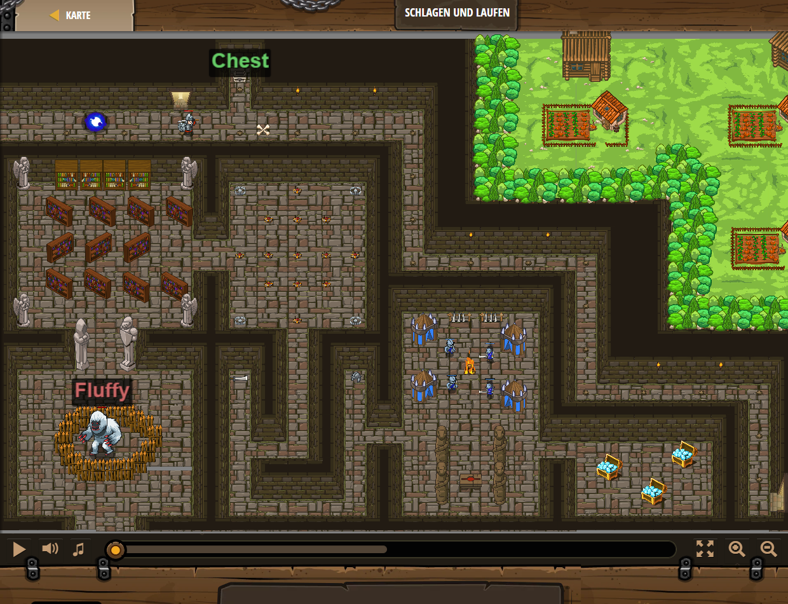

## **Schlagen und laufen**
## Level 1.15

#### Neu Gelerntes:
<b>-</b>

[comment]: <> (Was wurde gelernt und wie funktioniert die Technik?)

#### JavaScript-Code:
```js
hero.moveRight();
hero.moveUp();
hero.attack("Chest");
hero.moveDown();
while(true) {
    hero.moveRight(3);
    hero.moveDown(3);
}
```
