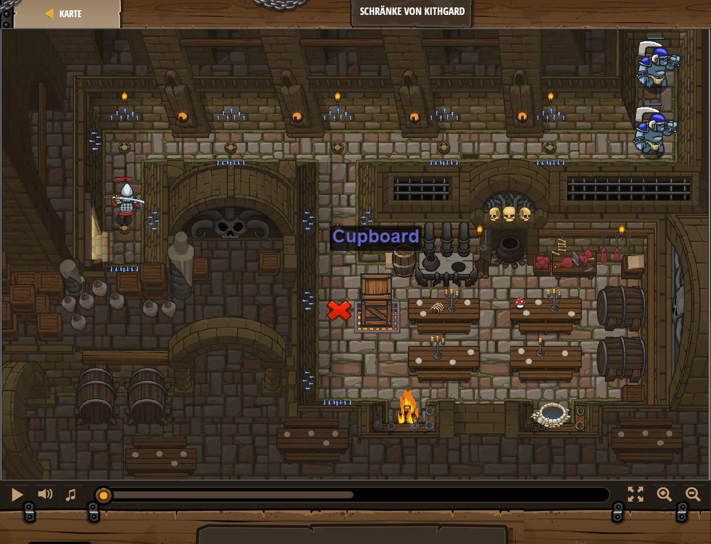

## **Schränke von Kithgard**
## Level 1.16

#### Neu Gelerntes:
<b>-</b>

[comment]: <> (Was wurde gelernt und wie funktioniert die Technik?)

#### JavaScript-Code:
```js
hero.moveUp();
hero.moveRight();
hero.moveRight();
hero.moveDown();
hero.moveDown();
while(true) {
    hero.attack("Cupboard");
}
```
