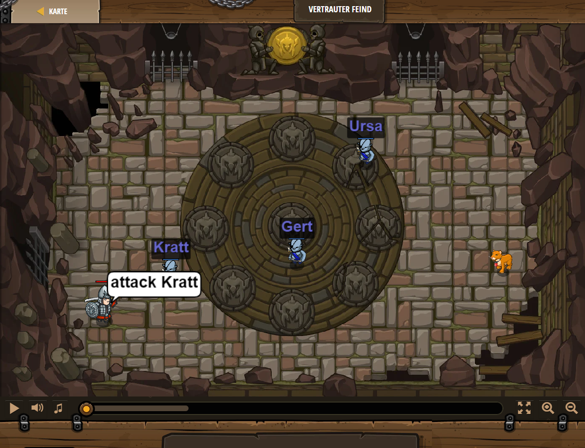

## **Vertrauter Feind**
## Level 1.17

#### Neu Gelerntes:
<b>-</b>

[comment]: <> (Was wurde gelernt und wie funktioniert die Technik?)

#### JavaScript-Code:
```js
var enemy1 = "Kratt";
var enemy2 = "Gert";
var enemy3 = "Ursa";
hero.attack(enemy1);
hero.attack(enemy1);
hero.attack(enemy2);
hero.attack(enemy3);
```
