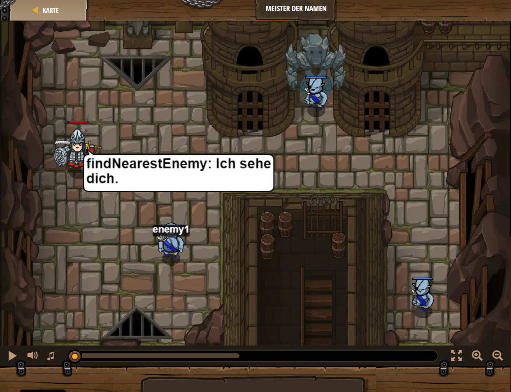

## **Meister der Namen**
## Level 1.18

#### Neu Gelerntes:
<b>-</b>

[comment]: <> (Was wurde gelernt und wie funktioniert die Technik?)

#### JavaScript-Code:
```js
var enemy1 = hero.findNearestEnemy();
hero.attack(enemy1);
hero.attack(enemy1);
while(true) {
   var enemy2 = hero.findNearestEnemy();
hero.attack(enemy2);
hero.attack(enemy2); 
}
```
