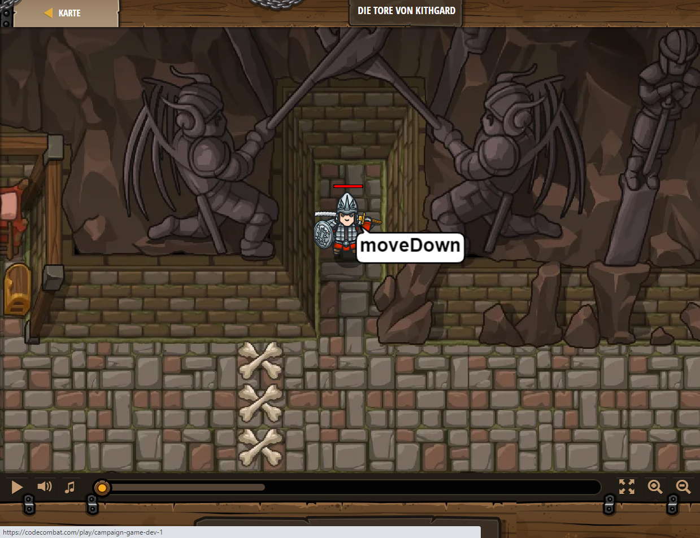

## **Die Tore von Kithgard**
## Level 1.20

#### Neu Gelerntes:
<b>-</b>

[comment]: <> (Was wurde gelernt und wie funktioniert die Technik?)

#### JavaScript-Code:
```js
hero.moveDown();
hero.buildXY("fence", 36, 34);
hero.buildXY("fence", 36, 30);
hero.buildXY("fence", 36, 26);
hero.moveRight(100);
```
