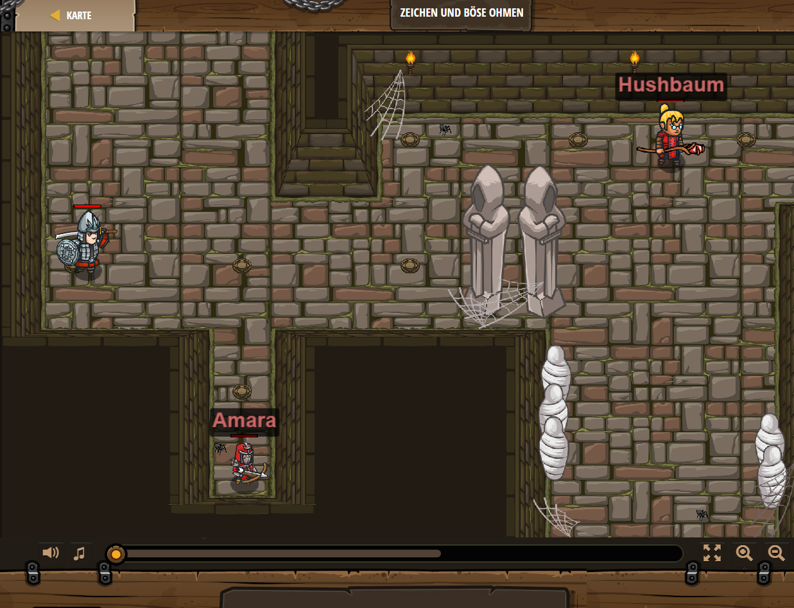

## **Zeichen und böse Ohmen**
## Level 1.5

#### Neu Gelerntes:
<b>-</b>

[comment]: <> (Was wurde gelernt und wie funktioniert die Technik?)

#### JavaScript-Code:
```js
hero.moveRight();
hero.moveRight();
hero.moveUp();
hero.moveRight(3);
hero.moveDown();
hero.moveRight();
hero.moveDown();
hero.moveRight();
```
