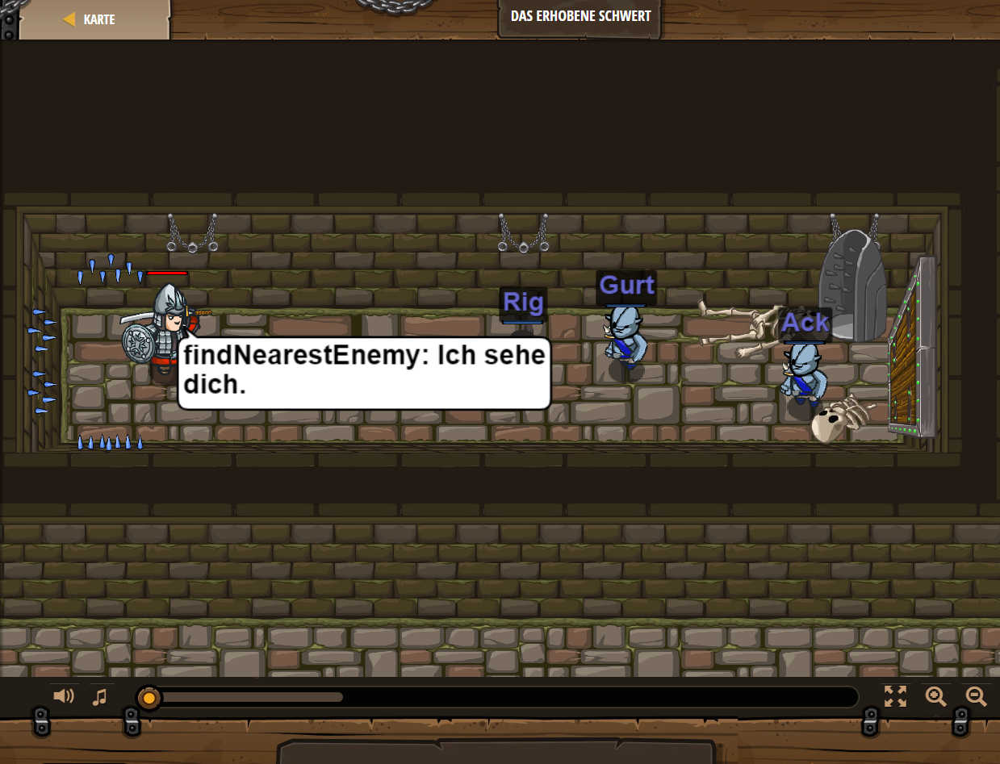

## **Das erhobene Schwert**
## Level 1.8

#### Neu Gelerntes:
<b>-</b>

[comment]: <> (Was wurde gelernt und wie funktioniert die Technik?)

#### JavaScript-Code:
```js
var enemy = hero.findNearestEnemy();
hero.attack(enemy);
var enemy = hero.findNearestEnemy();
hero.attack(enemy);
var enemy = hero.findNearestEnemy();
hero.attack(enemy);
```
