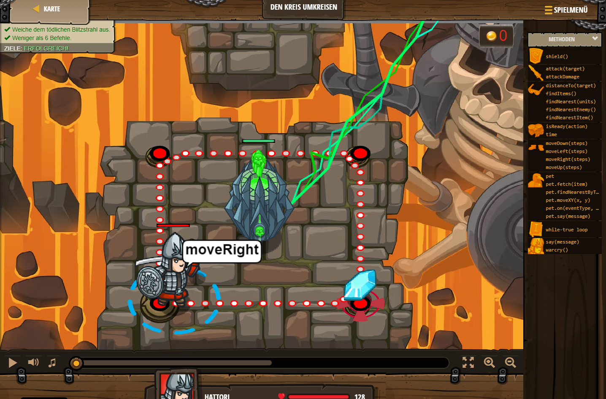

## **Den Kreis umkreisen**
## Level 1.b10

#### Neu Gelerntes:
<b>-</b>

[comment]: <> (Was wurde gelernt und wie funktioniert die Technik?)

#### JavaScript-Code:
```js
while(true) {
    hero.moveRight();
    hero.moveUp();
    hero.moveLeft();
    hero.moveDown();
}
```
