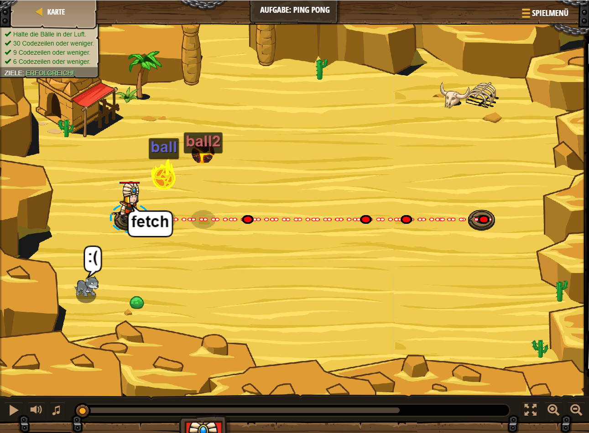

## **Aufgabe: Ping Pong**
## Level 1.b15

#### Neu Gelerntes:
<b>-</b>

[comment]: <> (Was wurde gelernt und wie funktioniert die Technik?)

#### JavaScript-Code:
```js
hero.say("fetch")
while(true) {
    hero.attack("ball2");
    hero.moveRight(3);
    hero.attack("ball2");
    hero.moveLeft(3);   
}
```
