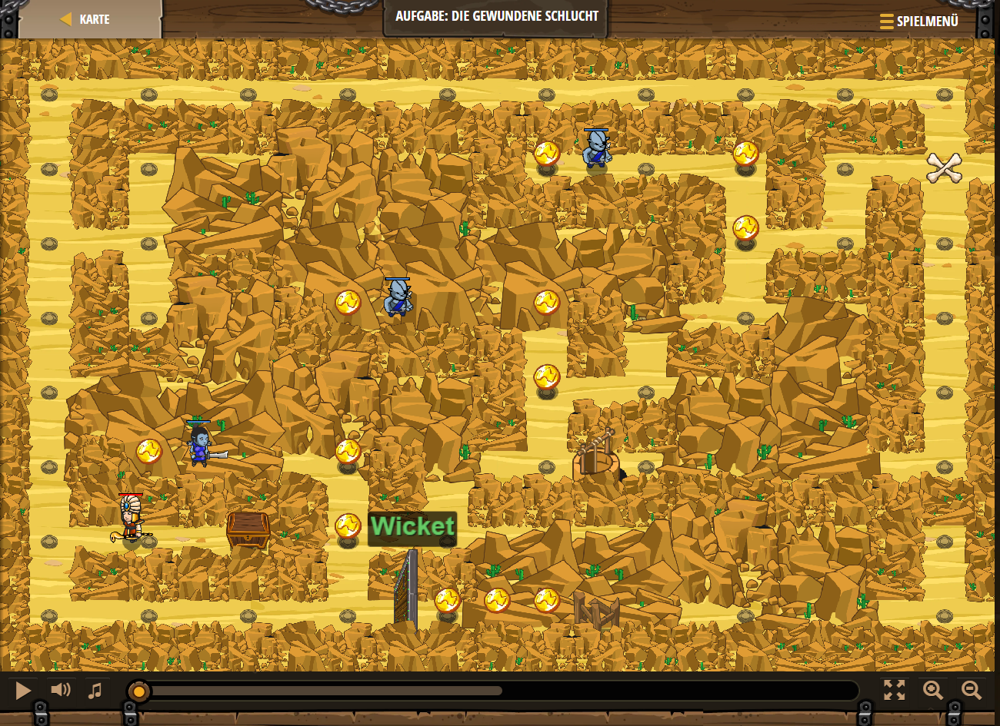

## **Aufgabe: Die gewundene Schlucht**
## Level 1.b17

#### Neu Gelerntes:
<b>-</b>

[comment]: <> (Was wurde gelernt und wie funktioniert die Technik?)

#### JavaScript-Code:
```js
hero.moveLeft();
hero.moveDown();
hero.moveRight(3);
hero.moveUp(2);
hero.moveLeft();
var enemy = hero.findNearestEnemy();
hero.attack(enemy);
hero.moveLeft();
hero.moveRight(2);
hero.moveDown(2);
hero.attack("Wicket");
hero.moveRight(2);
hero.moveLeft(2);
hero.moveUp();
hero.moveRight();
hero.moveUp();
hero.moveRight();
hero.moveUp(2);
var enemy = hero.findNearestEnemy();
hero.attack(enemy);
hero.moveLeft(2);
hero.moveRight(2);
hero.moveDown();
hero.moveRight();
hero.moveUp();
hero.moveRight();
hero.moveUp(2);
var enemy = hero.findNearestEnemy();
hero.attack(enemy);
hero.moveLeft(2);
hero.moveRight(2);
hero.moveDown();
hero.moveRight();
hero.moveUp();
hero.moveRight();
```
