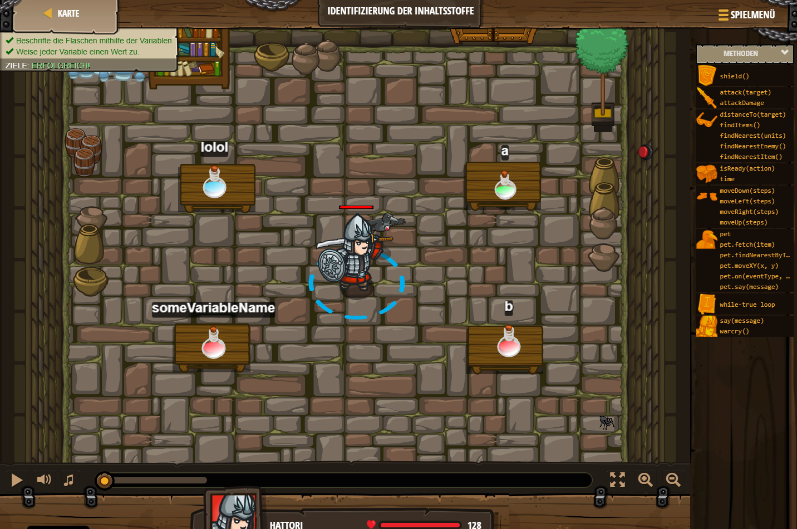

## **Identifizierung der Inhaltsstoffe**
## Level 1.b18

#### Neu Gelerntes:
<b>-</b>

[comment]: <> (Was wurde gelernt und wie funktioniert die Technik?)

#### JavaScript-Code:
```js
var someVariableName = "a string";
var lolol = 42;
var a = 1;
var b = 2;
```
