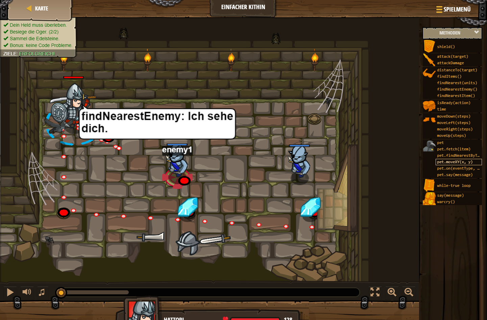

## **Einfacher Kithin**
## Level 1.b19

#### Neu Gelerntes:
<b>-</b>

[comment]: <> (Was wurde gelernt und wie funktioniert die Technik?)

#### JavaScript-Code:
```js
var enemy1 = hero.findNearestEnemy();
hero.attack(enemy1);
var enemy1 = hero.findNearestEnemy();
hero.attack(enemy1);
hero.moveDown();
hero.moveRight(3);
```
