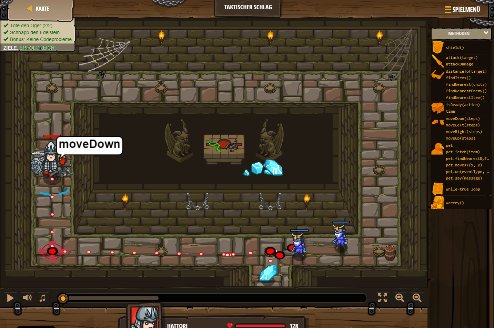

## **Taktischer Schlag**
## Level 1.b20

#### Neu Gelerntes:
<b>-</b>

[comment]: <> (Was wurde gelernt und wie funktioniert die Technik?)

#### JavaScript-Code:
```js
while(true) {
    hero.moveDown();
      var a = hero.findNearestEnemy();
      hero.attack(a);
       var a = hero.findNearestEnemy();
      hero.attack(a);
  }
```
