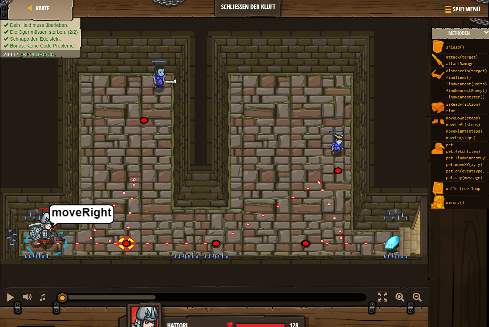

## **Schließen der Kluft**
## Level 1.b21

#### Neu Gelerntes:
<b>-</b>

[comment]: <> (Was wurde gelernt und wie funktioniert die Technik?)

#### JavaScript-Code:
```js
hero.moveRight();
while(true) {
    var enemy1 = hero.findNearestEnemy();
    hero.attack(enemy1);
    hero.moveRight();
}
```
