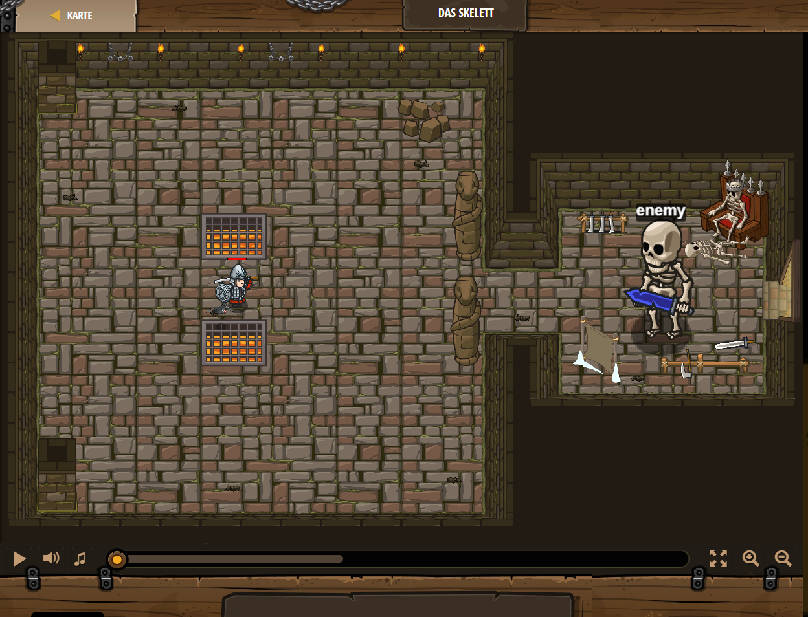

## **Das Skelett**
## Level 1.b25

#### Neu Gelerntes:
<b>-</b>

[comment]: <> (Was wurde gelernt und wie funktioniert die Technik?)

#### JavaScript-Code:
```js
while(true) {
    var enemy = hero.findNearestEnemy();
    hero.attack(enemy);
}
```
