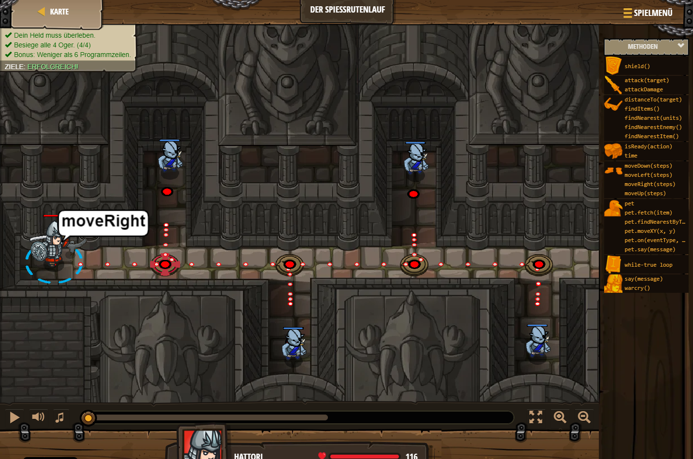

## **Der Spiessrutenlauf**
## Level 1.b27

#### Neu Gelerntes:
<b>-</b>

[comment]: <> (Was wurde gelernt und wie funktioniert die Technik?)

#### JavaScript-Code:
```js
while(true) { 
    hero.moveRight();
    var enemy = hero.findNearestEnemy();
    hero.attack(enemy);
}
```
