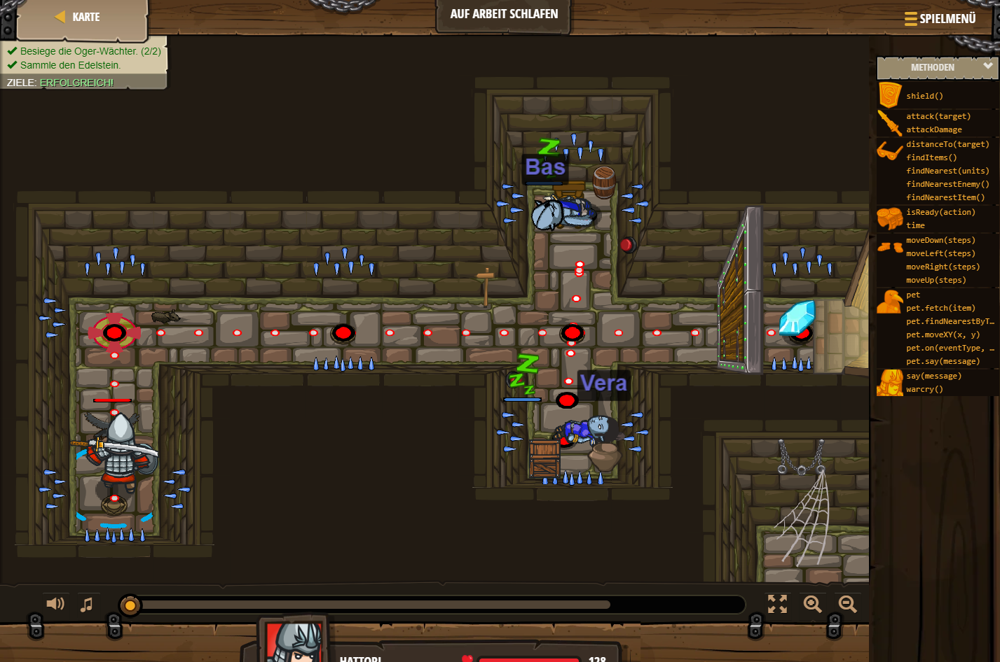

## **Auf Arbeit schlafen**
## Level 1.b5

#### Neu Gelerntes:
<b>-</b>

[comment]: <> (Was wurde gelernt und wie funktioniert die Technik?)

#### JavaScript-Code:
```js
hero.moveUp();
hero.moveRight();
hero.moveRight();
hero.attack("Bas");
hero.attack("Bas");
hero.attack("Vera");
hero.attack("Vera");
hero.moveRight();
```
