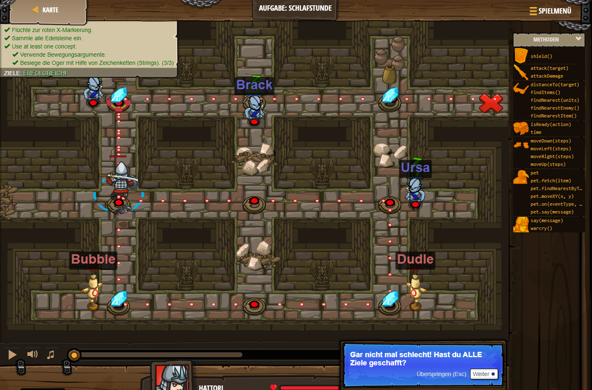

## **Aufgabe: Schlafstunde**
## Level 1.b6

#### Neu Gelerntes:
<b>-</b>

[comment]: <> (Was wurde gelernt und wie funktioniert die Technik?)

#### JavaScript-Code:
```js
hero.moveUp();
hero.attack("Rexxar");
hero.moveDown(2);
hero.moveRight(2);
hero.moveUp();
hero.attack("Ursa");
hero.moveLeft(2);
hero.moveUp();
hero.moveRight();
hero.attack("Brack");
hero.moveRight(2);
```
