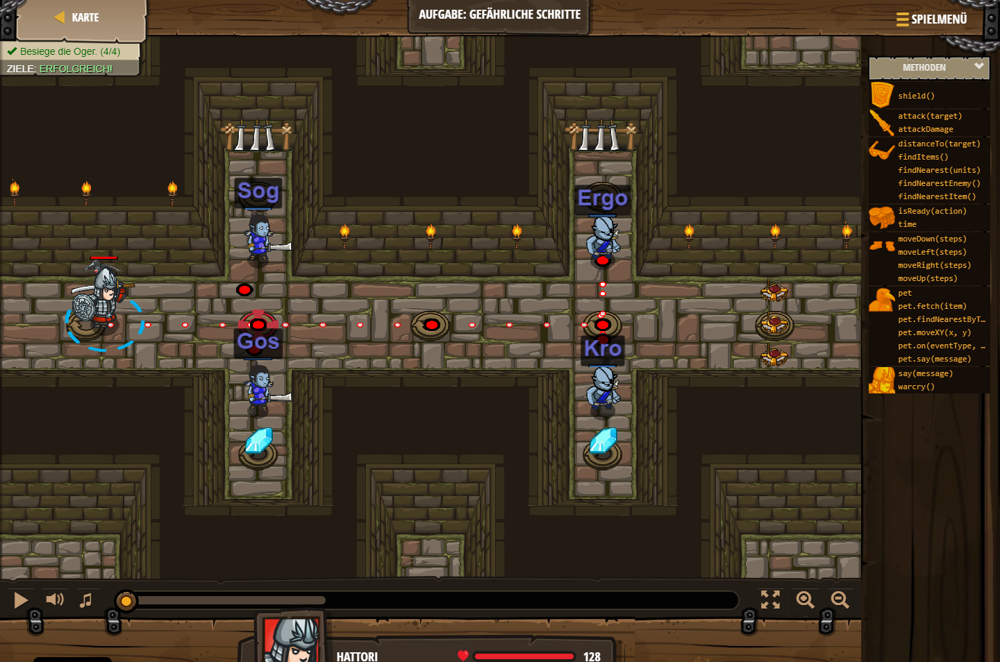

## **Aufgabe: Gefährliche Schritte**
## Level 1.b7

#### Neu Gelerntes:
<b>-</b>

[comment]: <> (Was wurde gelernt und wie funktioniert die Technik?)

#### JavaScript-Code:
```js
hero.moveRight();
hero.attack("Sog");
hero.attack("Gos");
hero.moveRight(2);
hero.attack("Ergo");
hero.attack("Kro");
```
