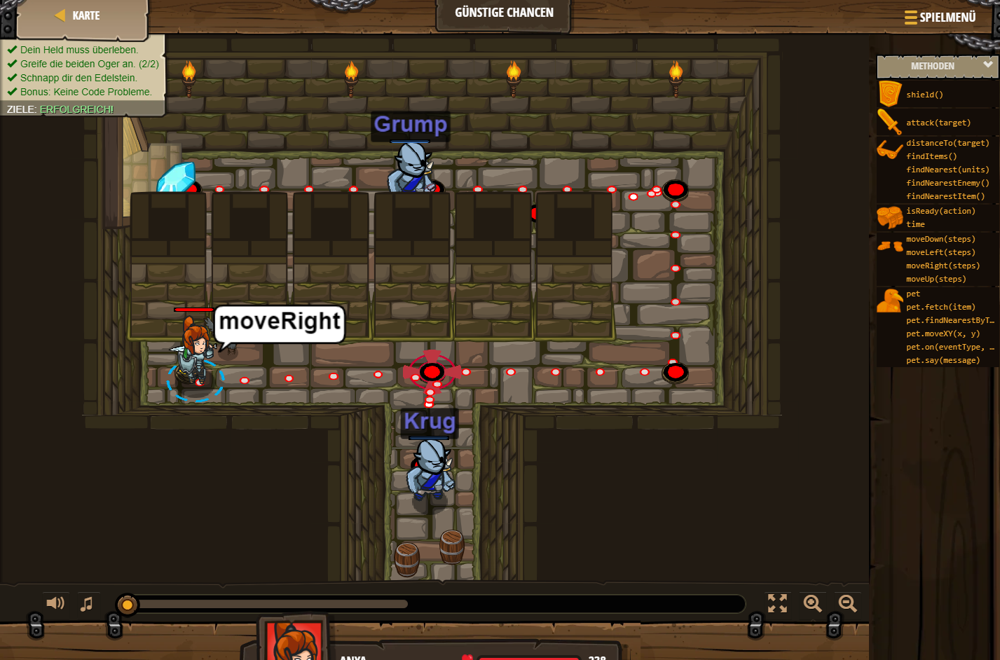

## **Günstige Chancen**
## Level 1.b8

#### Neu Gelerntes:
<b>-</b>

[comment]: <> (Was wurde gelernt und wie funktioniert die Technik?)

#### JavaScript-Code:
```js
hero.moveRight();
hero.attack("Krug");
hero.attack("Krug");
hero.moveRight();
hero.moveUp();
hero.attack("Grump");
hero.attack("Grump");
hero.moveLeft();
hero.moveLeft();
```
