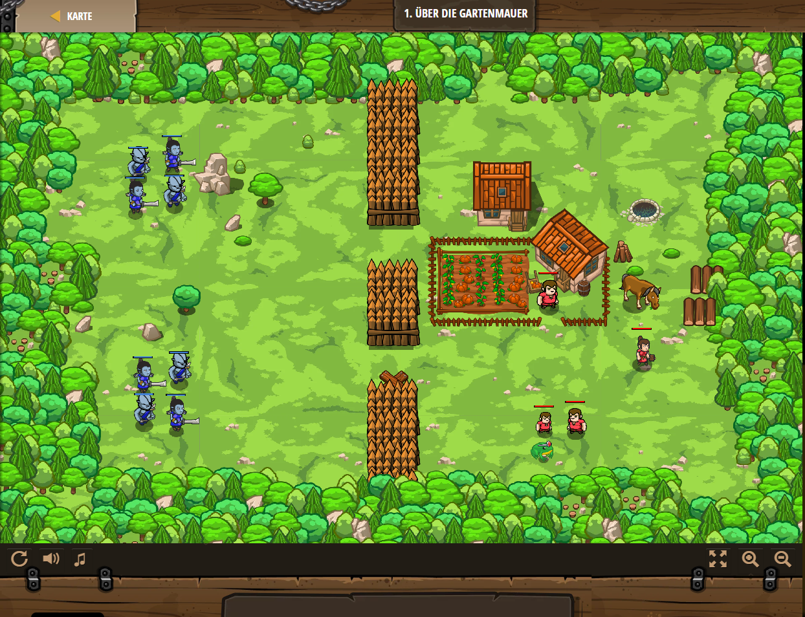

## **Über die Gartenmauer**
## Level 2.b1

#### Neu Gelerntes:
Erschaffen von Objekten durch Koordinaten

[comment]: <> (Was wurde gelernt und wie funktioniert die Technik?)

#### JavaScript-Code:
```js
// Benutze game.spawnXY(), um einen Zaun um den Bauernhof zu bauen!
game.spawnXY("fence", 39, 16);
// Erzeuge 2 weitere Zäune in 4 Metern Entfernung.
// Erzeuge einen Zaun ("fence") bei x,y 39, 20
game.spawnXY("fence", 39, 20);
// Erzeuge einen Zaun ("fence") bei x,y 39, 24
game.spawnXY("fence", 39, 24);
game.spawnXY("fence", 39, 28);
game.spawnXY("fence", 39, 32);
// Erzeuge 2 weitere Zäune in 4 Metern Entfernung.
// Erzeuge (spawn) einen Zaun ("fence") bei y 36
game.spawnXY("fence", 39, 36);
// Erzeuge (spawn) einen Zaun ("fence") bei y 40
game.spawnXY("fence", 39, 40);
game.spawnXY("fence", 39, 44);

```
