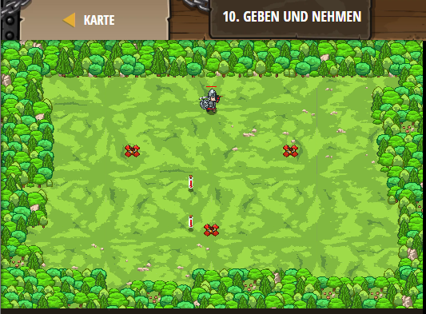

## **Geben und Nehmen**
## Level 2.b10

#### Neu Gelerntes:
<b>-</b>

[comment]: <> (Was wurde gelernt und wie funktioniert die Technik?)

#### JavaScript-Code:
```js
// Gehe zu allen X-Markierungen!
// Diese Feuerfallen tun weh!
game.spawnPlayerXY("samurai", 40, 50);
game.addSurviveGoal();
game.addMoveGoalXY(25,40);
game.spawnXY("fire-trap", 25, 40);
game.addMoveGoalXY(55,40);
game.spawnXY("fire-trap", 55, 40);
game.addMoveGoalXY(40,20);
game.spawnXY("fire-trap", 40, 20);
// Erzeuge ein paar kleine Zaubetränke ( "potion-small" ), um deinen Spieler heilen zu können.
game.spawnXY("potion-small", 36, 30);
game.spawnXY("potion-small", 36, 20);
```
