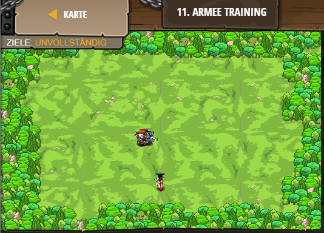

## **Armee Training**
## Level 2.b11

#### Neu Gelerntes:
<b>-</b>

[comment]: <> (Was wurde gelernt und wie funktioniert die Technik?)

#### JavaScript-Code:
```js
// Beschwöre einen Helden und füge ein Ziel hinzu,
game.spawnPlayerXY("champion", 40, 15);
game.addDefeatGoal();

// Beschwöre mindestens 2 "munchkin"s.
game.spawnXY("munchkin", 36, 30);
game.spawnXY("munchkin", 36, 30);
// Beschwöre mindestens 2 "thrower"s.
game.spawnXY("thrower", 36, 30);
game.spawnXY("thrower", 36, 30);
// Beschwöre mindestens 2 "soldier"s.
game.spawnXY("soldier", 36, 30);
game.spawnXY("soldier", 36, 30);
// Beschwöre mindestens 2 "archer"s.
game.spawnXY("archer", 36, 30);
game.spawnXY("archer", 36, 30);
```
