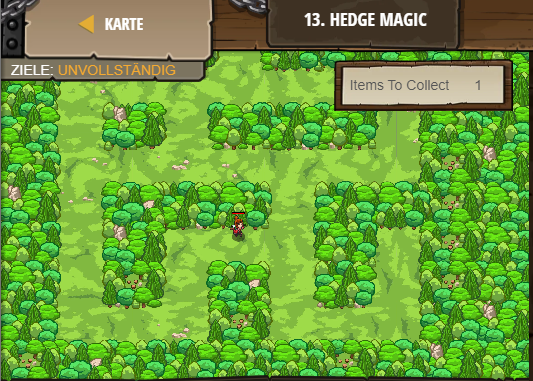

## **Hedge Magic**
## Level 2.b13

#### Neu Gelerntes:
<b>-</b>

[comment]: <> (Was wurde gelernt und wie funktioniert die Technik?)

#### JavaScript-Code:
```js
// Spawn a maze. Change the number for a different maze!
game.spawnMaze("forest", 3);
// Spawn a hero with spawnPlayerXY(type, x, y)
var player = game.spawnPlayerXY("captain", 36, 30);
// Add at least one goal!
game.addCollectGoal(1);
game.spawnXY("gem", 36, 30);
```
