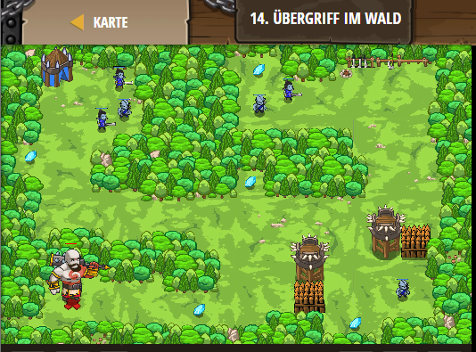

## **Übergriff im Wald**
## Level 2.b14

#### Neu Gelerntes:
Spieler anpassen

[comment]: <> (Was wurde gelernt und wie funktioniert die Technik?)

#### JavaScript-Code:
```js
game.addDefeatGoal();
game.addSurviveGoal();
var player = game.spawnPlayerXY("goliath", 12, 10);
// Erhöhe die maximale Geschwindigkeit (maxSpeed >4), damit er schneller rennt.
player.maxSpeed = 100;
// Erhöhe die maximale Gesundheit des Spieles (maxHealth > 500), damit er länger übersteht.
player.maxHealth = 10000
// Erhöhe die Angriffskraft (attackDamage; > 7.68), damit er schnell die Oger besiegen kann.
player.attackDamage = 10000
```
