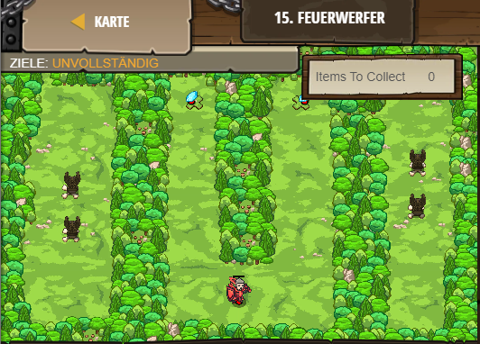

## **Feuerwerfer**
## Level 2.b15

#### Neu Gelerntes:
Bestimmten Objekten Variablen zuweisen und ihre Eigenschaften modifizieren

[comment]: <> (Was wurde gelernt und wie funktioniert die Technik?)

#### JavaScript-Code:
```js
var player = game.spawnPlayerXY("knight", 40, 10);
game.addCollectGoal();
game.addSurviveGoal();
game.spawnXY("gem", 32, 55);
game.spawnXY("gem", 51, 55);
var fs1 = game.spawnXY("fire-spewer", 12, 25);
var fs2 = game.spawnXY("fire-spewer", 70, 30);
var fs3 = game.spawnXY("fire-spewer", 12, 35);
var fs4 = game.spawnXY("fire-spewer", 70, 40);
// Change fs1.direction to "vertical":
fs1.direction = "vertical"; // ∆ Change the direction.
// Now set fs2.direction to "vertical":
fs2.direction = "vertical";
// Do the same for fs3 and fs4:
fs3.direction = "vertical";
// Now play the game and collect the gems!
fs4.direction = "vertical";
```
