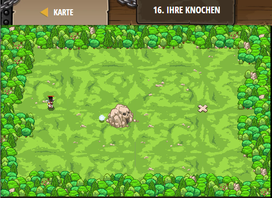

## **Ihre Knochen**
## Level 2.b16

#### Neu Gelerntes:
<b>-</b>

[comment]: <> (Was wurde gelernt und wie funktioniert die Technik?)

#### JavaScript-Code:
```js
var player = game.spawnPlayerXY("champion", 15, 35);
player.attackDamage = 1000;
player.maxSpeed = 30;
game.addSurviveGoal();
game.addDefeatGoal();
game.spawnXY("x-mark-stone", 60, 35);
// Erschaffe einen "generator".
game.spawnXY("generator", 36, 30);
// Erschaffe einen Leuchstein ("lighstone").
game.spawnXY("lightstone", 30, 30);
// Now beat your game!
```
