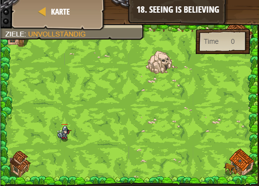

## **Seeing is believing**
## Level 2.b18

#### Neu Gelerntes:
Anzeigen von Daten im Interface mit ui.track

[comment]: <> (Was wurde gelernt und wie funktioniert die Technik?)

#### JavaScript-Code:
```js
// Players like seeing score, so use ui.track()!
// It will create a user-interface element for them to see.
var player = game.spawnPlayerXY("samurai", 20, 20);
game.addSurviveGoal(20);
var spawner = game.spawnXY("generator", 50, 50);
spawner.maxHealth = 9001;
spawner.spawnType = "munchkin";
spawner.spawnDelay = 1
// Add more spawners for more enemies on the field:
game.spawnXY("generator", 360, 30);
// ui.track() displays an object's property for players to see!
ui.track(game, "time");
// Use ui.track to track game's "defeated" property:
ui.track(game, "defeated")
player.attackDamage = 10000;
// Increase the hero's maxSpeed:
player.maxSpeed = 1000
// Press play and defeat 6 munchkins or skeletons!
player.maxHealth = 100000
```
