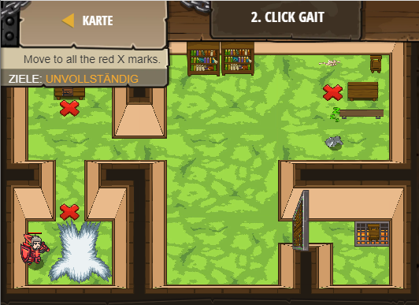

## **Click Gait**
## Level 2.b2

#### Neu Gelerntes:
<b>-</b>

[comment]: <> (Was wurde gelernt und wie funktioniert die Technik?)
#### JavaScript-Code:
```js
// Don't change any code. Just click PLAY button!
// Move to all the red X marks to win.
game.spawnPlayerXY("knight", 5, 8);
game.addMoveGoalXY(10, 18);
game.addMoveGoalXY(10, 38);
game.addMoveGoalXY(48, 41);
```
