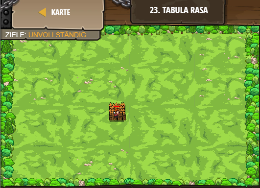

## **Tabula Rasa**
## Level 2.b21

#### Neu Gelerntes:
<b>-</b>

[comment]: <> (Was wurde gelernt und wie funktioniert die Technik?)

#### JavaScript-Code:
```js
// Create your own game!
// Spawn a player with spawnPlayerXY(type, x, y)
var player = game.spawnPlayerXY("captain", 36, 30);
// Add at least one goal!
game.addSurviveGoal(1);
// Spawn objects into the game with spawnXY(type, x, y)
game.spawnXY("fence", 36, 30);
```
