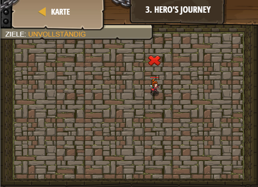

## **Hero's Journey**
## Level 2.b3

#### Neu Gelerntes:
Ziel festlegen und Spieler spawnen

[comment]: <> (Was wurde gelernt und wie funktioniert die Technik?)

#### JavaScript-Code:
```js
// Each game must have a player and a goal.
// Use game.spawnPlayerXY("captain", x, y)
// to add a player to your game:
var player = game.spawnPlayerXY("captain", 36, 30);
// Use game.addMoveGoalXY(x, y)
// to add a movement goal to your game:
// it should be 10m away from the player.
game.addMoveGoalXY(36, 40);
```
