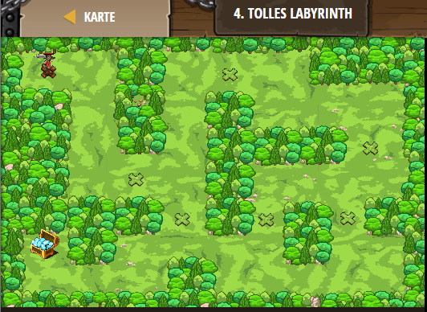

## **Tolles Labyrinth**
## Level 2.b4

#### Neu Gelerntes:
<b>-</b>

[comment]: <> (Was wurde gelernt und wie funktioniert die Technik?)

#### JavaScript-Code:
```js
// Lege das Ziel fest.
game.addCollectGoal(1);
// Füge einen Helden ein und eine Kiste zum einsammeln.
game.spawnPlayerXY("duelist", 9, 59);
game.spawnXY("chest", 17, 30);
game.spawnXY("forest", 26, 51);
// Füge noch zwei "forest" Objekte hinzu. Achte darauf die Edelsteinen nicht vollständig zu blockieren.
game.spawnXY("forest", 35, 23);
game.spawnXY("forest", 74, 30);

```
