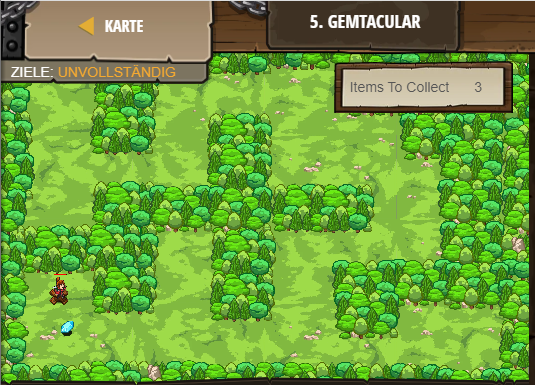

## **Gemtacular**
## Level 2.b5

#### Neu Gelerntes:
<b>-</b>

[comment]: <> (Was wurde gelernt und wie funktioniert die Technik?)

#### JavaScript-Code:
```js
game.spawnPlayerXY("captain", 9, 18);
// Add a goal to collect the gems using game.addCollectGoal()
game.addCollectGoal(3);
game.spawnXY("gem", 10, 11);
// Spawn 3 gems across the level for the player to collect:
game.spawnXY("gem", 10, 11);
game.spawnXY("gem", 10, 11);
```
