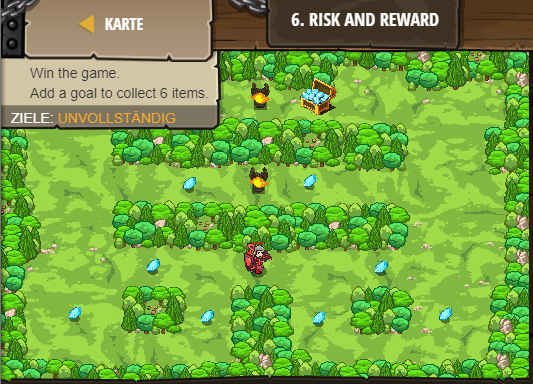

## **Risk and Reward**
## Level 2.b6

#### Neu Gelerntes:
<b>-</b>

[comment]: <> (Was wurde gelernt und wie funktioniert die Technik?)

#### JavaScript-Code:
```js
game.spawnPlayerXY("knight", 39, 23);

// Use game.addCollectGoal(X) to allow the player to win
// after collecting only X gems! (In this case, X should be 6)
game.addCollectGoal(6);
```
