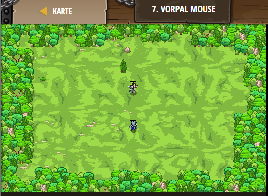

## **Vorpal Mouse**
## Level 2.b7

#### Neu Gelerntes:
<b>-</b>

[comment]: <> (Was wurde gelernt und wie funktioniert die Technik?)

#### JavaScript-Code:
```js
// The following code spawns a playable hero:
game.spawnPlayerXY("guardian", 40, 40);
// These add goals to the level:
game.addDefeatGoal();
game.addSurviveGoal();
// This spawns some enemies to fight:
game.spawnXY("munchkin", 40, 25);
// This spawns a maze for the player:
```
