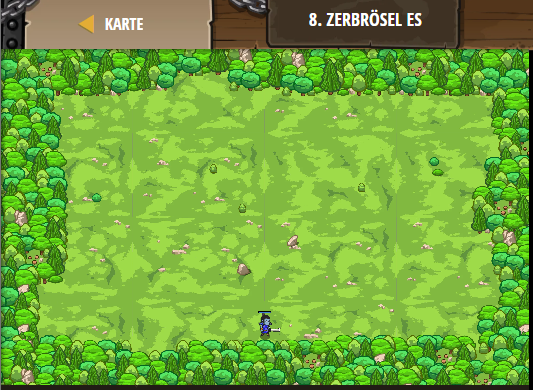

## **Zerbrösel es**
## Level 2.b8

#### Neu Gelerntes:
<b>-</b>

[comment]: <> (Was wurde gelernt und wie funktioniert die Technik?)

#### JavaScript-Code:
```js
// Erschaffe einen Held mit game.spawnPlayerXY(type, x, y).
var player = game.spawnPlayerXY("captain", 36, 30);
game.addSurviveGoal();
// Füge mit game.addDefeatGoal() ein Spielziel hinu
game.addDefeatGoal(1);
game.spawnXY("munchkin", 40, 10);
// Erschaffe mindestens drei weitere Kleinoger (Munchkins)
game.spawnXY("munchkin", 36, 30);
game.spawnXY("munchkin", 36, 30);
game.spawnXY("munchkin", 36, 30);
```
