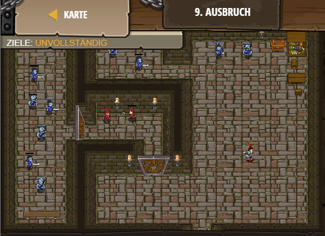

## **Ausbruch**
## Level 2.b9

#### Neu Gelerntes:
<b>-</b>

[comment]: <> (Was wurde gelernt und wie funktioniert die Technik?)

#### JavaScript-Code:
```js
// Der Spieler muss nur ein paar Gegner besiegen.
game.spawnPlayerXY("guardian", 62, 25);
// after defeating X enemies! (In this case, X should be 4)
game.addDefeatGoal(4);
```
