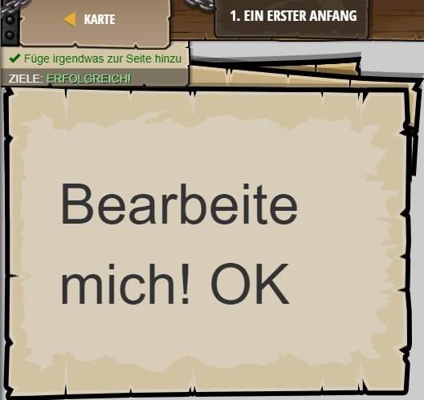

## **Ein erster Anfang**
## Level 3.b1

#### Neu Gelerntes:
<b>-</b>

[comment]: <> (Was wurde gelernt und wie funktioniert die Technik?)

#### HTML-Code:
```
<!-- Willkommen zur CodeCombat Web-Entwicklung! -->
<!-- Du wirst die Grundzüge der Web-Entwicklung kennenlernen! -->
<!-- Blaue Zeilen sind Kommentare. Lese sie, um Hilfe zu erhalten. -->

<!-- Schreibe unten irgendetwas hin, um die Webseite zu ändern. -->
Bearbeite mich!
OK
```

