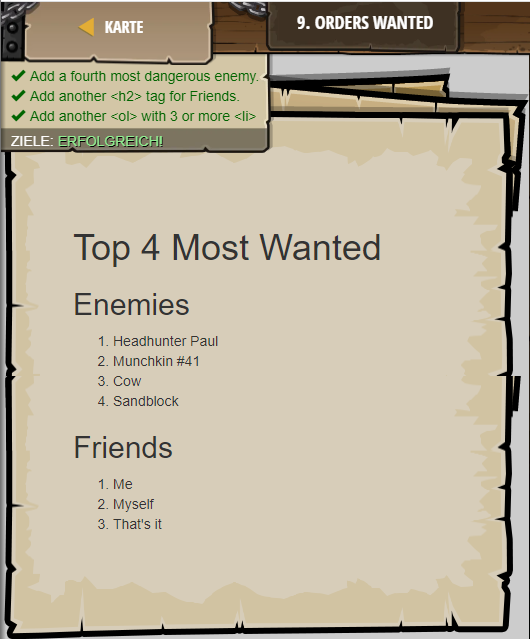

## **Orders Wanted**
## Level 3.b10

#### Neu Gelerntes:
Nummerierte Listen mit "ol" und "/ol"

[comment]: <> (Was wurde gelernt und wie funktioniert die Technik?)

#### HTML-Code:
```
<!-- The <ol> tag is used to create ordered lists. -->
<!-- It uses <li> still, but includes a number instead. -->
<h1>Top 4 Most Wanted</h1>
<h2>Enemies</h2>
<ol>
    <li>Headhunter Paul</li>
    <li>Munchkin #41</li>
    <li>Cow</li>
    <!-- Add another enemy here: -->
    <li>Sandblock</li>
</ol>
<!-- Add another <h2> for Friends:  -->
<h2>Friends</h2>
<!-- Add a new <ol> to contain those friends: -->
<ol>
    <li>Me</li>
    <!-- Add 3 or more <li> elements inside the <ol>: -->
    <li>Myself</li>
    <li>That's it</li>
</ol>
```

