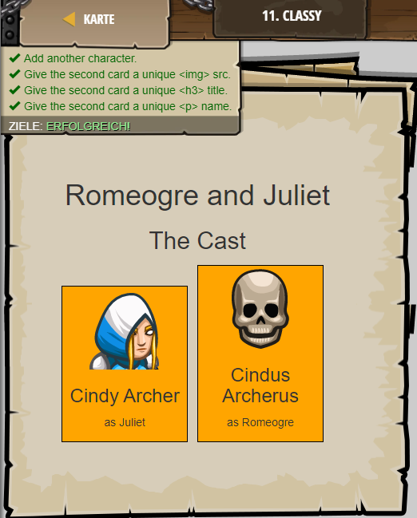

## **Classy**
## Level 3.b11

#### Neu Gelerntes:
CSS class mit .[Name] und "div class=["Name"]"

[comment]: <> (Was wurde gelernt und wie funktioniert die Technik?)

#### HTML-Code:
```
<!-- The "class" attribute makes styling easier. -->
<!-- Use it to style specific repeated elements! -->
<style>
    /* The "." tells CSS to target a "class" name. */
    .character {
        background-color:orange;
    }
</style>
<div>
    <h1>Romeogre and Juliet</h1>
    <h2>The Cast</h2>
</div>
<!-- The class attribute has been added to these <div> -->
<div class="character">
    
    <h3>Cindy Archer</h3>
    <p>as Juliet</p>
</div>
<!-- Include the main star Romeogre! -->
<!-- Add another <div> with the "character" class: -->
<div class="character">
    
    <h3>Cindus Archerus</h3>
    <p>as Romeogre</p>
</div>
```

