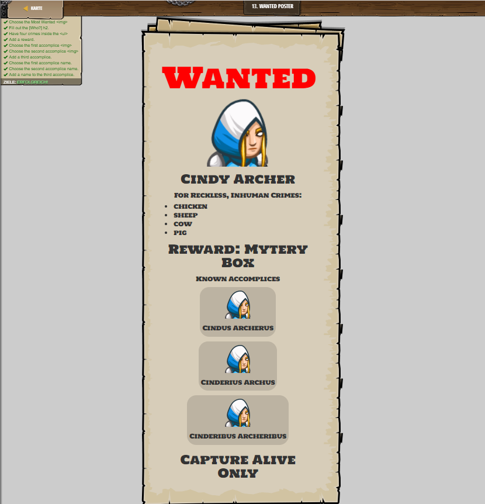

## **Wanted Poster**
## Level 3.b13

#### Neu Gelerntes:
<b>-</b>

[comment]: <> (Was wurde gelernt und wie funktioniert die Technik?)

#### HTML-Code:
```
<style>
    h1 {
        color: red;
    }
    h1 {
        font-size: 7em;
    }
    h2 {
        /* Change the number to change the size of the header text. */
        font-size: 3em;
    }
    h3 {
        font-size: 1.5em;
    }
    li {
        font-size:1.5em;
    }
</style>
<h1>Wanted</h1>
<!-- Find an image from the Image Gallery above, or use your own image link -->

<!-- Who is wanted? -->
<h2>Cindy Archer</h2>
<!-- What are they wanted for? -->
<h3>For Reckless, Inhuman Crimes:</h3>
<ul>
    <li>chicken</li>
    <li>sheep</li>
    <li>cow</li>
    <li>pig</li>
</ul>
<!-- What is the reward? -->
<h2>Reward: Mytery Box</h2>
<!-- Who are their partners in crime? -->
<h3>Known Accomplices</h3>
<div>
    <div>
        
        <h3>Cindus Archerus</h3>
    </div>
    <div>
        
        <h3>Cinderius Archus</h3>
    </div>
    <!-- Add a third accomplice here. Choose whether they are class "captured". -->
    <div>
        
        <h3>Cinderibus Archeribus</h3>
    </div>
</div>
<!-- How do want them captured? -->
<h2>Capture Alive Only</h2>
```

