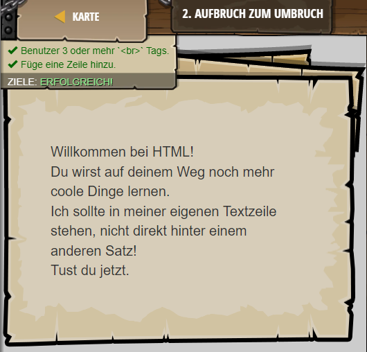

## **Aufbruch zum Umbruch**
## Level 3.b2

#### Neu Gelerntes:
Zeilenumbrüche mit "br"

[comment]: <> (Was wurde gelernt und wie funktioniert die Technik?)

#### HTML-Code:
```
<!-- In HTML benutzt du Tags um deinen Text zu formatieren. -->
<!-- Alle HTML-Tags beginnen mit < und enden mit >. -->
<!-- Der Text zwischen < > bestimmt, was ein Tag macht. -->
<!-- Der <br>-Tag erzeugt einen Zeilenumbruch zwischen zwei Textzeilen. -->
Willkommen bei HTML!
<br>
Du wirst auf deinem Weg noch mehr coole Dinge lernen.
<!-- Für eine Zeile tiefer einen <br>-Tag hinzu: -->
<br>
Ich sollte in meiner eigenen Textzeile stehen, nicht direkt hinter einem anderen Satz!
<!-- Füge eine Zeile tiefer noch ein <br> hinzu und schreibe noch eine Zeile Text dazu: -->
<br>
Tust du jetzt.
```

