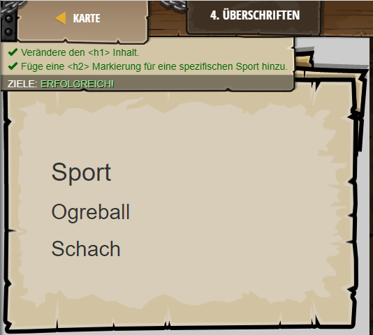

## **Überschriften**
## Level 3.b4

#### Neu Gelerntes:
Überschriften mit h1 bis h4 und /h1 bis /h4

[comment]: <> (Was wurde gelernt und wie funktioniert die Technik?)

#### HTML-Code:
```
<!-- Überschriften Markierungen beschreiben Inhalte. -->
<!-- <h1> Markierungen werden für die Überschrift der Seite benutzt. -->
<!-- <h2> bis <h4> Markierungen sind Unter-Überschriften.  -->
<h1>Sport</h1> <!-- ∆ Ändere diese Zeile zu einem beliebigen Inhalt. -->
<h2>Ogreball</h2>
<!-- Füge eine andere <h2> Markierung hinzu mit dem Namen einer Sportart!  -->
<h2>Schach</h2>
```

