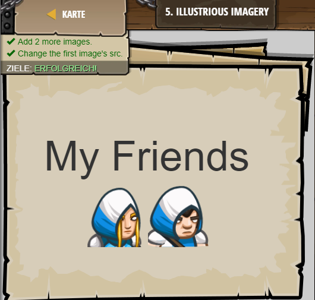

## **Illustrious Imagery**
## Level 3.b5

#### Neu Gelerntes:
Grafiken mit "img src=["link"]"

[comment]: <> (Was wurde gelernt und wie funktioniert die Technik?)

#### HTML-Code:
```
<!-- It is possible to add images to webpages. -->
<!-- You will need to know the URL of the image. -->
<!-- Click "Image Gallery" for CodeCombat images. -->
<h1>My Friends</h1>
 <!-- ∆ Change this src! -->
<!-- Add 2 more images to fill up the page! -->

```

