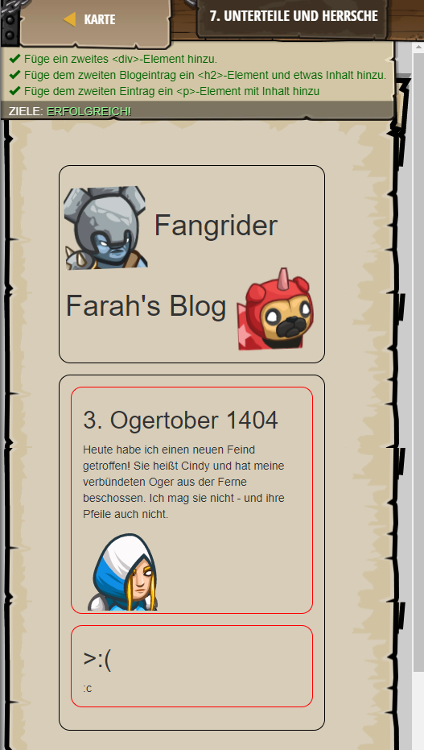

## **Unterteile und herrsche**
## Level 3.b6

#### Neu Gelerntes:
Informationen mit "div" und "/div" gruppieren

[comment]: <> (Was wurde gelernt und wie funktioniert die Technik?)

#### HTML-Code:
```
<!-- Das <div>-Element gruppiert die Information. -->
<!-- Benutze <div>-Elemente, um deine Webseite zu organisieren. -->
<!-- Jeder Blogeintrag unten ist innerhalb eines <div> enthalten -->
<div>
    <h2>3. Ogertober 1404</h2>
    <p>
        Heute habe ich einen neuen Feind getroffen! Sie heißt Cindy und hat meine verbündeten Oger aus der Ferne beschossen. Ich mag sie nicht - und ihre Pfeile auch nicht.
    </p>
    
</div>
<!-- Füge noch eine <div> hinzu. -->
<div>
    <!-- Füge ein <h2>-Element hinzu, um einen Titel zu erzeugen: -->
    <h2> Kopfgeld </h2>
    <!-- Füge ein <p>-Element hinzu, um dem Blogeintrag Inhalt zu geben. -->
    <p> 10$
</div>
```

