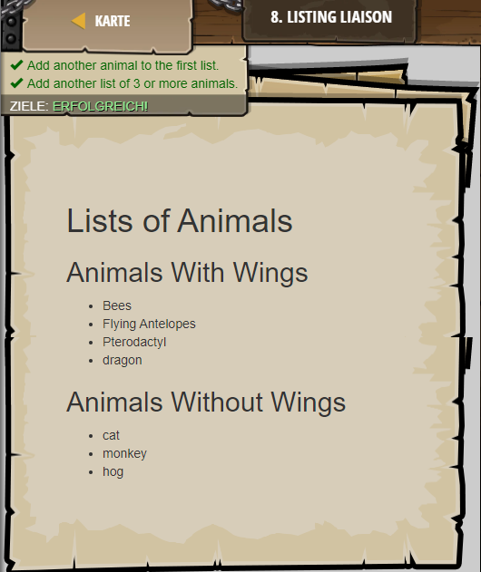

## **Listing Liasion**
## Level 3.b7

#### Neu Gelerntes:
Listen mit "ul" und "/ul" und Stichpunkte mit "li" und "/li"

[comment]: <> (Was wurde gelernt und wie funktioniert die Technik?)

#### HTML-Code:
```
<!-- <ul> tags are for grouping <li> tags. -->
<!-- <ul> stands for "Unordered List" --> 
<!-- <li> are individual list items. -->
<h1>Lists of Animals</h1>
<h2>Animals With Wings</h2>
<ul>
    <li>Bees</li>
    <li>Flying Antelopes</li>
    <li>Pterodactyl</li>
    <!-- Add another animal inside a <li> tag. -->
    <li>dragon</li>
</ul>
<!--  Add another <h2> tag to define a new list -->
<h2>Animals Without Wings</h2>
<!-- Add a <ul> tag to group <li> elements. -->
<ul>
    <li>cat</li>
    <!-- Add 3 or more <li> tags with names of animals! -->
    <li>monkey</li>
    <li>hog</li>
</ul>
```

