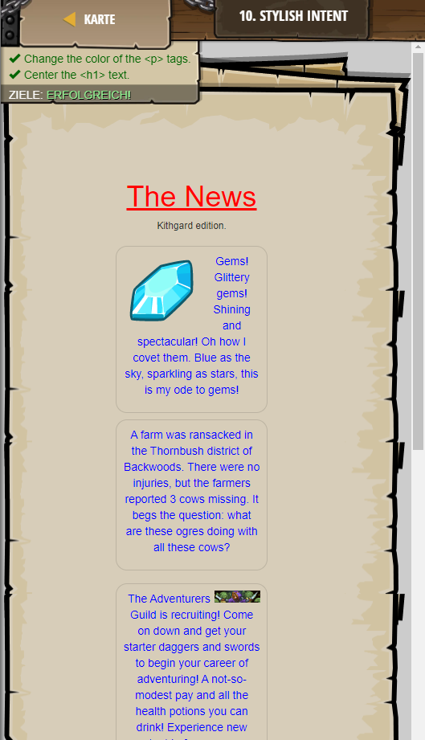

## **Stylish intent**
## Level 3.b8

#### Neu Gelerntes:
Textstil mit "style" und "/style" mithilfe von CSS bearbeiten
"text-align:center" zentriert den text
"color:" verändert die Textfarbe

[comment]: <> (Was wurde gelernt und wie funktioniert die Technik?)

#### HTML-Code:
```
<!-- The <style> tag style your HTML with CSS. -->
<!-- Check the hints for more information on CSS! -->

<h1>The News</h1> <!-- Name the newspaper. -->
<h6>Kithgard edition.</h6>
<style>
    h6 {
        text-align: center;
    }
    h1 {
        color: red;
        text-decoration: underline;
        /* Align to center using the text-align: */
        text-align:center;
    }
    p {
        text-align:center;
        /* Give all paragraph text a color: */
        /* Colors can be purple, orange, blue, etc! */
        color: blue
    }
</style>
```

