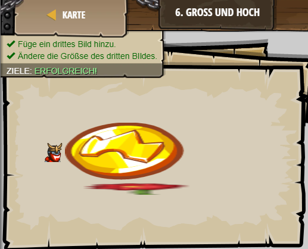

## **Gross und hoch**
## Level 3.b9

#### Neu Gelerntes:
Breite und Höhe eines Bildes durch "img width=[Breite] height=[Höhe] src=[link]" modifizieren

[comment]: <> (Was wurde gelernt und wie funktioniert die Technik?)

#### HTML-Code:
```
<!--  können durch Benutzung der Eigenschaften die Größe ändern. -->
<!-- width= und height= erzwingen die Größe für  Tags. -->
<!-- Das Bild skaliert proportional wenn eine der Eigenschaften gesetzt ist. -->
<!-- Wen beide gesetzt sind, wird sich das BIld an die Größe anpaßen. -->
<!-- Das Bild hat die Größe 32x32 anstelle der standartmäßigen 100x100 -->

<!-- Dieses Bild wird auf die Größe 200x100 gezwungen! -->

<!-- Füge ein weiteres  Tag hinzu und benutze Höhe oder Breite: -->

```

