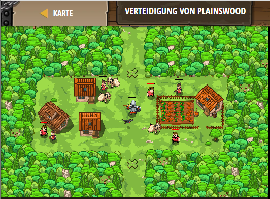

## **Verteidigung von Plainswood**
## Level 4.1

#### Neu Gelerntes:
<b>-</b>

[comment]: <> (Was wurde gelernt und wie funktioniert die Technik?)

#### JavaScript-Code:
```js
// Baue zwei Zäune, um die Dorfbewohner zu schützen!
// Bewege deine Maus über die Welt, um die X, Y Koordinaten zu bekommen.
hero.buildXY("fence", 40, 52);
hero.buildXY("fence", 40, 21);
```
